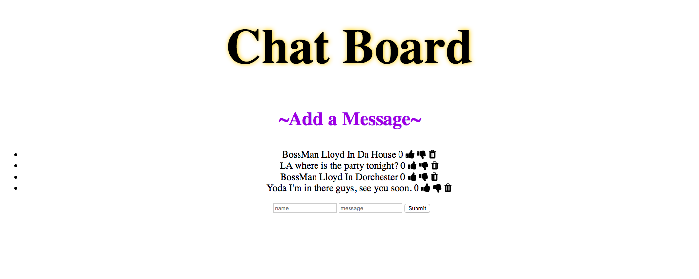

# SAVAGE DEMO
This is a platform for friends/family and groups to be able to connect with one another on the message board.
Participants are also able to thumbs up or down on the messages as well as delete them.

**Tech used:** HTML, CSS, JavaScript

# Installation
Clone repo
run npm install

# Usage
run node server.js
Navigate to localhost:3000
